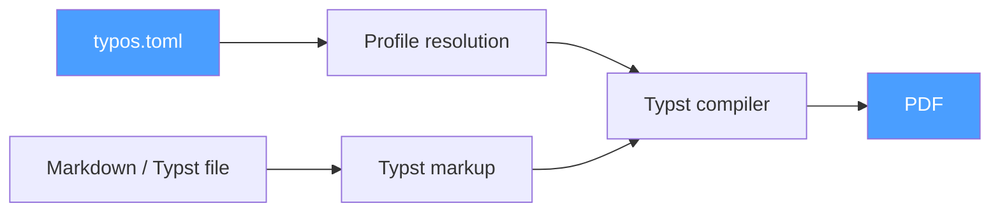

<div align="center">

# typos

**A self-contained Markdown & Typst to branded PDF converter**

Turn Markdown or Typst files into branded PDFs — without needing LaTeX or Pandoc.

[](LICENSE)
[](https://github.com/LuMiSxh/typos/releases)

[Features](#features) • [Installation](#installation) • [Quick Start](#quick-start) • [Configuration](#configuration) • [Template Reference](CONFIGURATION.md)

</div>

---

## How It Works



Define your layout and metadata (colors, logo, author name, fonts) in `typos.toml` under distinct profiles. Run `typos convert` to generate your PDF.

## Features

- **Self-contained**: A single binary with no external dependencies (no Pandoc, LaTeX, or Node required).
- **Flexible inputs**: Write in Markdown (`.md`) or pass Typst (`.typ`) files straight through to the template.
- **Native math support**: Delimiters like `$alpha$` or `$$E = mc^2$$` render as native Typst math rather than plain text.
- **Bundled fonts**: Includes Libertinus Serif, DejaVu Sans Mono, and NewCM Math so documents render identically on any machine.
- **Multiple profiles**: Inherit and share common settings between profiles using the `extends` property.
- **Per-document overrides**: Use TOML front-matter at the top of a file to override specific profile settings just for that document.
- **Watch mode**: Automatically rebuilds PDFs on save using `typos watch <path>`.
- **Batch conversion**: Convert entire directories in parallel with `typos batch <dir>`.
- **Interactive mode**: Run `typos` with no arguments for a step-by-step CLI prompt.
- **Custom templates**: Use your own Typst layout per-profile or globally.
- **Cross-platform**: Support for macOS, Linux, and Windows.

---

## Installation

### Quick Install (macOS / Linux)

```bash
curl -fsSL https://raw.githubusercontent.com/LuMiSxh/typos/main/install.sh | sh
```

### Quick Install (Windows PowerShell)

```powershell
irm https://raw.githubusercontent.com/LuMiSxh/typos/main/install.ps1 | iex
```

Both installers add `typos` to your `PATH` automatically (current user by default). For a system-wide install, set `TYPOS_INSTALL_SCOPE=system` (Unix, may need `sudo`) or `$env:TYPOS_INSTALL_SCOPE = "system"` (Windows, needs an elevated shell) before running the command above.

### Manual Download

| Platform            | Archive                                  |
| ------------------- | ---------------------------------------- |
| Linux x86_64        | `typos-x86_64-unknown-linux-gnu.tar.gz`  |
| Linux ARM64         | `typos-aarch64-unknown-linux-gnu.tar.gz` |
| macOS x86_64        | `typos-x86_64-apple-darwin.tar.gz`       |
| macOS Apple Silicon | `typos-aarch64-apple-darwin.tar.gz`      |
| Windows x86_64      | `typos-x86_64-pc-windows-msvc.zip`       |

### From Source

```bash
git clone https://github.com/LuMiSxh/typos.git
cd typos
cargo install --path .
```

---

## Quick Start

```bash
# Create a typos.toml in your project
typos init

# Edit typos.toml to set your profile details, then:
typos convert report.md --profile my_brand

# Open the PDF as soon as it's ready
typos convert report.md --profile my_brand --open

# Multiple profiles at once
typos convert report.md --profile brand_a,brand_b

# Pass a .typ file directly — same template, same branding
typos convert report.typ --profile my_brand

# Batch-convert a whole directory in parallel
typos batch ./docs --profile all

# Watch a file or directory and re-convert on every change
typos watch ./docs --profile my_brand

# Interactive mode (no arguments)
typos
```

### Per-document overrides via front-matter

Any `.md` or `.typ` file can start with a TOML front-matter block. These values override profile fields just for that document:

```markdown
+++
author = "Co-Author Name"
header_text = "Draft — Do Not Distribute"
+++

# My Report

…
```

Unknown front-matter keys are exposed to your Typst template as `typos-<key>` variables.

---

## Math in Markdown

typos uses **Typst math syntax** instead of LaTeX. Delimiters follow comrak's standard `math_dollars` extension:

| Mode            | Syntax           | Typst output     |
| --------------- | ---------------- | ---------------- |
| Inline          | `$alpha + beta$` | `$alpha + beta$` |
| Display (block) | `$$E = m c^2$$`  | `$ E = m c^2 $`  |

**Note:** Avoid putting spaces between the dollar signs and the characters. For example, `$ alpha $` is treated as literal text, while `$alpha$` is parsed as math.

### LaTeX → Typst cheatsheet

| LaTeX                           | Typst                              |
| ------------------------------- | ---------------------------------- |
| `\alpha`, `\theta`, …           | `alpha`, `theta`, … (no backslash) |
| `45^\circ`                      | `45 degree`                        |
| `\cdot`                         | `dot`                              |
| `\approx`                       | `approx`                           |
| `\Delta`                        | `Delta`                            |
| `\vec{x}`                       | `vec(x)`                           |
| `\begin{pmatrix}…\end{pmatrix}` | `mat(a, b; c, d)`                  |
| `\text{m}`                      | `"m"`                              |
| `\to` / `\rightarrow`           | `->`                               |

### Example

```markdown
The rotation matrix is $$R = mat(cos theta, -sin theta; sin theta, cos theta)$$.

A point $vec(x, y)$ is transformed by multiplying with $R$.

The result has magnitude $sqrt(x^2 + y^2) approx 1.41 "m"$.
```

---

## Configuration

Run `typos init` to generate a `typos.toml`, then edit it:

```toml
[[profiles]]
name = "acme"

[profiles.identity]
display_name = "ACME Corp"
author       = "Jane Smith"
institute    = "ACME Corporation"
email        = "jane@acme.com"

[profiles.colors]
primary = "#E63946"
text    = "#1D3557"
heading = "$colors.primary"   # variable reference — heading tracks primary

[profiles.layout]
logo = "assets/acme-logo.png"

# Inherit everything from "acme" and override just the identity
[[profiles]]
name    = "acme-jdoe"
extends = "acme"
[profiles.identity]
author = "John Doe"
email  = "john@acme.com"
```

Every configuration field is optional. Anything left unset falls back to the built-in default. You can reference other fields in the same profile using the `$section.field` syntax.

For the full list of fields, font specification, length values, `extends` semantics, custom variables (`vars`), front-matter, and how to write a custom Typst template, see **[CONFIGURATION.md](CONFIGURATION.md)**.

---

## Commands

| Command                                                 | Description                                                      |
| ------------------------------------------------------- | ---------------------------------------------------------------- |
| `typos convert <file> [--profile name,…\|all] [--open]` | Convert a single `.md`/`.typ` file                               |
| `typos batch <dir> [--profile name,…\|all]`             | Convert every `.md` and `.typ` under `dir` (recursive, parallel) |
| `typos watch <path> [--profile name,…\|all]`            | Watch a file or directory and re-convert on save                 |
| `typos list`                                            | List profiles from the nearest typos.toml                        |
| `typos init`                                            | Create a sample typos.toml                                       |

---

## Development

```bash
git clone https://github.com/LuMiSxh/typos.git
cd typos
cargo build
cargo test
cargo clippy
```

---

## License

MIT — see [LICENSE](LICENSE).

---

<div align="center">

**An open-source project by LuMiSxh**

[GitHub](https://github.com/LuMiSxh/typos) • [Issues](https://github.com/LuMiSxh/typos/issues) • [Releases](https://github.com/LuMiSxh/typos/releases)

</div>
