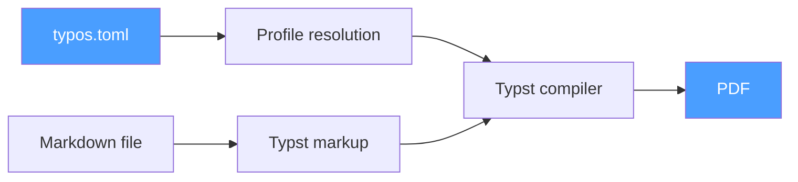

<div align="center">

# typos

**Self-contained Markdown to branded PDF converter**

Convert Markdown files to beautifully branded PDFs — no LaTeX, no Pandoc, no external tools required.

[](LICENSE)
[](https://github.com/LuMiSxh/typos/releases)

[Features](#features) • [Installation](#installation) • [Quick Start](#quick-start) • [Configuration](#configuration)

</div>

---

## How It Works



Define your branding (colors, logo, name, fonts) in `typos.toml` as profiles. Run `typos convert`. Get a PDF.

## Features

- **Self-contained**: single binary, zero external dependencies — no Pandoc, no LaTeX, no Node
- **Cross-platform**: macOS, Linux, Windows
- **Multiple profiles**: run once and output one PDF per brand in a single command
- **Flexible fonts**: system fonts by name, or provide your own TTF/OTF file
- **Interactive mode**: run `typos` with no arguments for a guided flow
- **Custom templates**: override the built-in Typst layout per-profile or globally

---

## Installation

### Quick Install (macOS / Linux)

```bash
curl -fsSL https://raw.githubusercontent.com/LuMiSxh/typos/main/install.sh | sh
```

### Quick Install (Windows PowerShell)

```powershell
irm https://raw.githubusercontent.com/LuMiSxh/typos/main/install.ps1 | iex
```

### Manual Download

| Platform | Archive |
|---|---|
| Linux x86_64 | `typos-x86_64-unknown-linux-gnu.tar.gz` |
| Linux ARM64 | `typos-aarch64-unknown-linux-gnu.tar.gz` |
| macOS x86_64 | `typos-x86_64-apple-darwin.tar.gz` |
| macOS Apple Silicon | `typos-aarch64-apple-darwin.tar.gz` |
| Windows x86_64 | `typos-x86_64-pc-windows-msvc.zip` |

### From Source

```bash
git clone https://github.com/LuMiSxh/typos.git
cd typos
cargo install --path .
```

---

## Quick Start

```bash
# Create a typos.toml in your project
typos init

# Edit typos.toml to set your profile details, then:
typos convert report.md --profile my_brand

# Multiple profiles at once
typos convert report.md --profile brand_a,brand_b

# Batch convert a whole directory
typos batch ./docs --profile all

# Interactive mode (no arguments)
typos
```

---

## Configuration

```toml
[defaults]
output_dir = "output"
main_font = "Arial"
mono_font = "Consolas"

[[profiles]]
name = "acme"
display_name = "ACME Corp"
primary_color = "#E63946"
text_color = "#1D3557"
author = "Jane Smith"
institute = "ACME Corporation"
email = "jane@acme.com"
logo = "assets/acme-logo.png"
logo_height = "1cm"

[[profiles]]
name = "personal"
display_name = "Personal"
primary_color = "#2196F3"
author = "Jane Smith"
email = "jane@personal.dev"
main_font = { path = "fonts/MyFont.ttf" }
```

### Font specification

```toml
# System font by name
main_font = "Arial"

# File path (TTF or OTF)
main_font = { path = "fonts/CustomFont.ttf" }
```

### Custom template

```toml
[defaults]
template = "my_layout.typ"   # applies to all profiles

[[profiles]]
name = "special"
template = "special_layout.typ"  # overrides for this profile only
```

---

## Commands

| Command | Description |
|---|---|
| `typos convert <file> [--profile name,…\|all]` | Convert a single file |
| `typos batch <dir> [--profile name,…\|all]` | Convert all .md files in a directory |
| `typos list` | List profiles from the nearest typos.toml |
| `typos init` | Create a sample typos.toml |

---

## Development

```bash
git clone https://github.com/LuMiSxh/typos.git
cd typos
cargo build
cargo test
cargo clippy
```

---

## License

MIT — see [LICENSE](LICENSE).

---

<div align="center">

**Made with passion by LuMiSxh**

[GitHub](https://github.com/LuMiSxh/typos) • [Issues](https://github.com/LuMiSxh/typos/issues) • [Releases](https://github.com/LuMiSxh/typos/releases)

</div>
