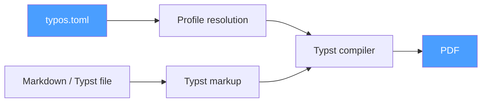

<div align="center">

# typos

**Self-contained Markdown & Typst → branded PDF converter**

Turn Markdown or Typst files into beautifully branded PDFs — no LaTeX, no Pandoc, no external tools.

[](LICENSE)
[](https://github.com/LuMiSxh/typos/releases)

[Features](#features) • [Installation](#installation) • [Quick Start](#quick-start) • [Configuration](#configuration) • [Template Reference](CONFIGURATION.md)

</div>

---

## How It Works



Define your branding (colors, logo, name, fonts) in `typos.toml` as profiles. Run `typos convert`. Get a PDF.

## Features

- **Self-contained**: single binary, zero external dependencies — no Pandoc, no LaTeX, no Node
- **Markdown _or_ Typst input**: `.md` files are converted; `.typ` files pass straight through to the template
- **Native math**: `$alpha$`, `$->$`, `$$E = mc^2$$` render as real Typst math, not literal text
- **Bundled fonts**: ships with Libertinus Serif + DejaVu Sans Mono + NewCM Math — identical output on every machine
- **Multiple profiles** with `extends` inheritance — share common settings, override per brand
- **Per-document overrides**: TOML front-matter at the top of a file overrides profile fields just for that file
- **Watch mode**: `typos watch path` rebuilds on every save
- **Parallel batch**: `typos batch dir` converts a whole tree in parallel
- **Interactive mode**: run `typos` with no arguments for a guided flow
- **Custom templates**: replace the built-in layout per-profile or globally
- **Cross-platform**: macOS, Linux, Windows

---

## Installation

### Quick Install (macOS / Linux)

```bash
curl -fsSL https://raw.githubusercontent.com/LuMiSxh/typos/main/install.sh | sh
```

### Quick Install (Windows PowerShell)

```powershell
irm https://raw.githubusercontent.com/LuMiSxh/typos/main/install.ps1 | iex
```

### Manual Download

| Platform | Archive |
|---|---|
| Linux x86_64 | `typos-x86_64-unknown-linux-gnu.tar.gz` |
| Linux ARM64 | `typos-aarch64-unknown-linux-gnu.tar.gz` |
| macOS x86_64 | `typos-x86_64-apple-darwin.tar.gz` |
| macOS Apple Silicon | `typos-aarch64-apple-darwin.tar.gz` |
| Windows x86_64 | `typos-x86_64-pc-windows-msvc.zip` |

### From Source

```bash
git clone https://github.com/LuMiSxh/typos.git
cd typos
cargo install --path .
```

---

## Quick Start

```bash
# Create a typos.toml in your project
typos init

# Edit typos.toml to set your profile details, then:
typos convert report.md --profile my_brand

# Open the PDF as soon as it's ready
typos convert report.md --profile my_brand --open

# Multiple profiles at once
typos convert report.md --profile brand_a,brand_b

# Pass a .typ file directly — same template, same branding
typos convert report.typ --profile my_brand

# Batch-convert a whole directory in parallel
typos batch ./docs --profile all

# Watch a file or directory and re-convert on every change
typos watch ./docs --profile my_brand

# Interactive mode (no arguments)
typos
```

### Per-document overrides via front-matter

Any `.md` or `.typ` file can start with a TOML front-matter block. The values override profile fields just for that document:

```markdown
+++
author = "Co-Author Name"
header_text = "Draft — Do Not Distribute"
+++

# My Report

…
```

Unknown front-matter keys are exposed to your Typst template as `typos-<key>` variables.

---

## Configuration

Run `typos init` to generate a `typos.toml`, then edit it:

```toml
[defaults]
output_dir = "output"
# Defaults to the bundled Libertinus Serif / DejaVu Sans Mono — works on any machine.
# Override only if you want a different look.
# main_font = "Inter"
# mono_font = "JetBrains Mono"

[[profiles]]
name         = "acme"
display_name = "ACME Corp"
primary_color = "#E63946"
text_color    = "#1D3557"
author        = "Jane Smith"
institute     = "ACME Corporation"
email         = "jane@acme.com"
logo          = "assets/acme-logo.png"
logo_height   = "1cm"

# Inherit everything from "acme", override just the author
[[profiles]]
name    = "acme-jdoe"
extends = "acme"
author  = "John Doe"
email   = "john@acme.com"
```

For the full list of fields, font specification, length values, `extends` semantics, custom variables (`vars`), front-matter, and how to write a custom Typst template, see **[CONFIGURATION.md](CONFIGURATION.md)**.

---

## Commands

| Command | Description |
|---|---|
| `typos convert <file> [--profile name,…\|all] [--open]` | Convert a single `.md`/`.typ` file |
| `typos batch <dir> [--profile name,…\|all]` | Convert every `.md` and `.typ` under `dir` (recursive, parallel) |
| `typos watch <path> [--profile name,…\|all]` | Watch a file or directory and re-convert on save |
| `typos list` | List profiles from the nearest typos.toml |
| `typos init` | Create a sample typos.toml |

---

## Development

```bash
git clone https://github.com/LuMiSxh/typos.git
cd typos
cargo build
cargo test
cargo clippy
```

---

## License

MIT — see [LICENSE](LICENSE).

---

<div align="center">

**Made with passion by LuMiSxh**

[GitHub](https://github.com/LuMiSxh/typos) • [Issues](https://github.com/LuMiSxh/typos/issues) • [Releases](https://github.com/LuMiSxh/typos/releases)

</div>
